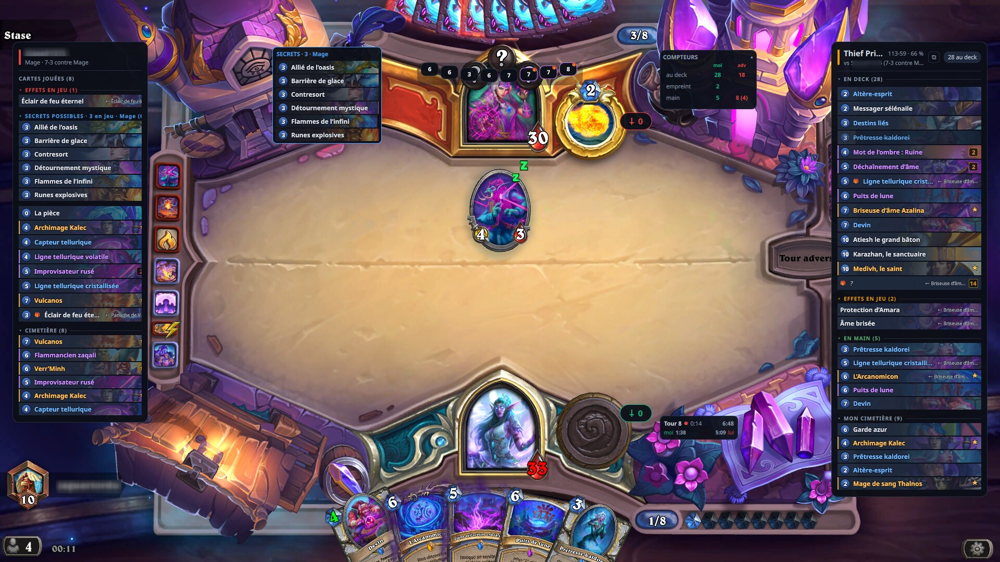
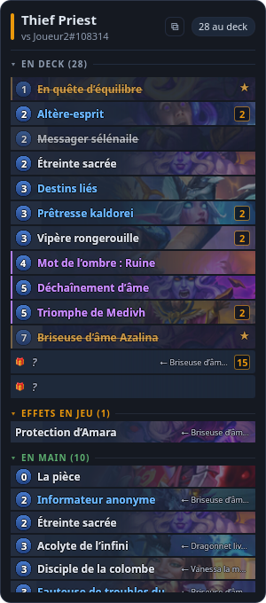
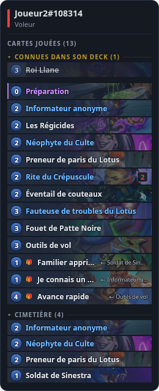
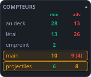
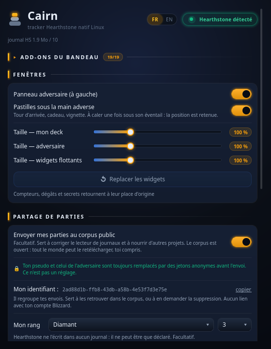
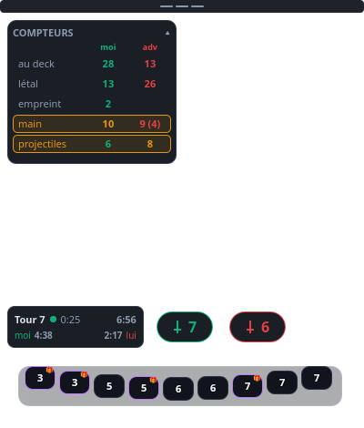

# Cairn

**Le tracker Hearthstone qui tourne *nativement* sous Linux.** Pas d'Electron, pas
d'Overwolf, pas de Wine côté tracker : Cairn lit les journaux que le jeu écrit
lui-même, depuis Linux, en **~170 Mo de mémoire privée / 260 Mo de RSS** — mesurés,
dix fenêtres ouvertes et une partie complète chargée. Comptez davantage après une
longue session. À titre de comparaison, Firestone sous Wine tourne autour de 4 Go.


[](https://github.com/Ratpido-dev/cairn/actions/workflows/tests.yml)


**Français** · [English](README.md)

<p align="center">
  
</p>

<p align="center">
  
  
  
</p>

---

## Pourquoi celui-ci plutôt qu'un autre

Il existe d'excellents trackers Hearthstone. Aucun n'est pensé pour Linux.

| | Cairn | HDT | Firestone |
|---|---|---|---|
| Plateforme | **Linux natif** | Windows (via Wine) | Windows / Overwolf (via Wine) |
| Mémoire mesurée ici | **~170 Mo privé** | non mesuré | **1,5 à 4,2 Go** |
| Deuxième prefix Wine à faire tourner | **non** | oui | oui |
| Lecture mémoire du jeu / injection | **non** | oui | oui |
| Règles de fenêtres Wayland fournies | **oui** | non | non |
| Compte, télémétrie | **aucun** | optionnels | oui |

Faire tourner un tracker Windows sous Wine, à côté d'un Hearthstone qui tourne déjà
sous Wine, c'est payer deux fois. Sur un portable à 8 Go, Firestone provoquait chez moi
des **OOM kills du jeu lui-même** : c'est ce qui a fait naître ce projet.

Cairn ne parle jamais au jeu. Il lit un fichier texte que Hearthstone écrit de son
plein gré, et affiche ce qu'il y trouve. Rien à injecter, rien à contourner, rien qui
puisse casser à la prochaine mise à jour de Blizzard.

## Ce qu'il faut pour que ça marche sous Linux — et que personne ne dit

Deux obstacles rendent le suivi de partie difficile sous Linux. Ils sont résolus.

**1. Hearthstone plafonne ses journaux à 10 Mo.** Au-delà, il écrit `Truncating log…`
puis **ferme le descripteur**. Sous Windows il recrée le fichier et continue ; sous Wine
cette étape échoue et le suivi devient définitivement aveugle — en général au milieu de
ta troisième partie. La solution tient en une ligne, `FileSizeLimit.Int=-1` dans le
`client.config` du dossier d'installation, et Cairn la pose tout seul (bouton du
launcher, ou `cairn-doctor --fix`).

**2. Sous Wayland, un client ne peut pas se placer lui-même.** Les coordonnées sont
ignorées, le compositeur pose tout au centre. Cairn installe des règles KWin
`cairn-pos-*` en mode *Remember*, une par widget, et surtout une règle `layer=overlay`
— la seule couche qui passe **au-dessus d'un jeu en plein écran exclusif**. Sur les
autres bureaux, les fenêtres portent des titres stables et l'app_id `cairn` : de quoi
les cibler dans GNOME Extensions, Hyprland, Sway ou `wmctrl`.

## Installation

```bash
git clone https://github.com/Ratpido-dev/cairn.git
cd cairn
./install.sh            # --desktop pour une icône sur le bureau
```

Aucun `sudo`, aucun paquet système : tout va dans `~/.local`, selon la norme XDG. Le
script crée un environnement Python isolé, télécharge la base de cartes, configure
Hearthstone (journaux + plafond de taille) et pose le raccourci. Ensuite, **Cairn** est
dans le menu d'applications.

Prérequis : Python ≥ 3.10 et son module `venv` (`python3-venv` sur Debian/Ubuntu,
`python3-virtualenv` sur Fedora, inclus dans `python` sur Arch). PySide6 apporte Qt
tout seul.

```bash
cairn                   # le tracker
cairn-doctor [--fix]    # diagnostic complet de l'installation
cairn-cards --check     # la base de cartes est-elle à jour ?
./install.sh --uninstall  # tes parties et réglages sont conservés
```

Le prefix Wine/Proton est **détecté** (Lutris, Steam/Proton, Heroic, Bottles,
PlayOnLinux, wine nu). En cas de doute : `export CAIRN_HS_PREFIX=/chemin/vers/le/prefix`.

## Ce que Cairn montre

<p align="center">
  
</p>

**Le deck qui vit.** Restantes, piochées, probabilité de pioche — et surtout **ce qui
entre** dans le deck en cours de partie : bombes, fléaux, cadeaux de Rafaam, copies
d'Azalina. Chaque ligne porte l'illustration de sa carte.

**Haut et fond de deck.** Hearthstone ne journalise pas l'ordre du deck : toute carte
qui y entre reçoit `ZONE_POSITION value=0`. La seule façon de savoir qu'une carte est au
fond, c'est de connaître l'effet qui l'y a mise — Cairn le déduit du **texte** des
cartes au téléchargement, donc sans liste à maintenir à chaque extension.

**Des compteurs qui n'apparaissent que s'ils servent.** Rafaam, cadavres, dragons de
Zarimi, cycle de sorts de Yogg — un compteur ne s'affiche que si la carte qui le
justifie a été vue, ou si la classe adverse peut la jouer. Et ils sont **symétriques** :
quand Azalina copie le début de partie d'en face, le compteur apparaît aussi de ton côté.

**L'Atlas de Godfrey**, la file des cartes surpiochées dans l'ordre où elles
reviendront, à leur coût réduit, des deux côtés. **Les pools de résurrection** au
survol : ce qu'une carte peut *réellement* ramener, pas la liste théorique. **La main
adverse** avec le tour d'arrivée et l'origine de chaque carte. **Les candidats secrets**
de la classe du secret posé — pas du héros adverse, ce n'est pas la même chose.

Plus : chrono de partie et de tour, temps de réflexion par joueur, dégâts possibles de
chaque camp (mal d'invocation compris), import automatique des decks depuis `Decks.log`,
historique et winrates locaux par deck et par classe.

<p align="center">
  
</p>

## Ton winrate contre *ce deck-là*, pas contre sa classe

Un taux de victoire par classe mélange des decks qui n'ont rien à voir. Mesuré sur mes
propres archives : **39 % face au Démoniste en moyenne — mais 29 % contre un Rafaam et
75 % contre le reste.** La moyenne par classe cachait deux matchups opposés, et c'est
exactement l'information qui manquait.

Cairn reconnaît donc l'archétype d'en face pendant la partie, et tient les statistiques
par archétype. Deux mécanismes, du plus fort au plus faible :

- **les listes de référence que tu colles.** Tu donnes un code de deck, Cairn le décode
  et compare toutes les cartes vues sortir du deck adverse à toutes les listes connues
  de sa classe. Sept cartes banales qui figurent toutes dans la même liste valent une
  signature ;
- **les cartes-signatures câblées**, en repli, quand aucune liste de cette classe n'est
  connue.

**82 % des parties archivées reçoivent une étiquette, et 0 % de faux positifs** sur
6 000 tirages simulés. Trois partis pris expliquent ces chiffres :

1. **L'étiquette est la carte-signature ou le nom de la liste collée, jamais un nom
   d'archétype du méta.** « Démoniste · Rafaam », pas « Rafaamlock » : c'est vérifiable,
   ça ne périme pas au patch suivant et ça ne demande aucune veille.
2. **Une carte créée ne prouve rien.** Un Rafaam obtenu par Découverte ne fait pas un
   deck Rafaam — sinon un Prêtre voleur, qui joue les cartes des autres, serait catalogué
   dans l'archétype de sa victime.
3. **Sans preuve, « inconnu ».** Un adversaire qui concède au tour 2 n'a rien montré : il
   compte dans sa classe, pas dans un archétype. Deviner fausserait le seul chiffre qu'on
   cherche.

Rien n'est scrapé : HSGuru interdit explicitement les agents automatiques, et dépendre
d'un site tiers aurait fait cesser Cairn de fonctionner le jour où sa page change. Coller
un code marche hors ligne et te laisse choisir quand rafraîchir.

## Regarder, et lancer

**Mode spectateur.** Hearthstone journalise une partie regardée exactement comme les
tiennes — même format, mêmes tags, les deux mains révélées. Sans garde-fou, elles
entraient donc dans ton historique et faussaient tes winrates. Cairn apprend tout seul
ton identifiant de compte, reconnaît les parties où tu n'es aucun des deux joueurs,
**les affiche mais ne les enregistre pas**.

**Lancer le jeu depuis le launcher.** Il n'existe pas une façon de lancer Hearthstone
sous Linux, alors Cairn ne cherche pas un jeu qui *s'appelle* Hearthstone : il cherche
celui qui **habite le prefix qu'il surveille déjà**. Lutris et les entrées `.desktop`
sont reconnus ainsi ; pour un script maison, un `umu-run` bricolé ou Bottles, le champ
« commande de lancement » du launcher gagne toujours. Un raccourci pour les cas
courants, un mécanisme manuel pour tous les autres.

## Il ne périme pas tout seul

Un patch d'équilibrage change les coûts et les effets. Un tracker qui ne s'en aperçoit
pas affiche des mensonges — et ne le dit pas.

À chaque lancement, Cairn compare l'empreinte HTTP de sa base de cartes à celle de
HearthstoneJSON (une requête `HEAD`, toutes les 12 h au plus) et retélécharge si le jeu
a été patché. Et parce qu'un patch peut changer non pas la *donnée* mais **l'effet**
d'une carte dont le code suppose le comportement, le téléchargement compare aussi le
texte des cartes câblées dans le moteur, et prévient quand l'une d'elles a été
reformulée. `cairn-doctor` garde l'alerte visible jusqu'à ce qu'elle soit traitée.

## Vie privée

Cairn ne parle à personne. Il n'y a ni compte, ni télémétrie, ni serveur : tout vit dans
`~/.local/share/cairn`. Les seules requêtes réseau sont la base de cartes et les
illustrations, chez HearthstoneJSON.

Le partage de parties existe, mais il est **désactivé par défaut** et se pose une fois,
explicitement. Un `Power.log` contient deux identifiants par joueur — le battletag et le
`GameAccountId` — que le RGPD range parmi les données personnelles. Le point dur n'est
pas l'utilisateur, qui consent pour lui-même, mais **son adversaire**, qui n'a rien
demandé : les identifiants sont donc remplacés par des jetons stables, salés par
installation, avant tout départ. Un test vérifie qu'une partie pseudonymisée **se rejoue
à l'identique** — la protection ne coûte rien, c'est ce qui la rend tenable.

**Ce n'est pas un réglage.** Il n'existe aucun moyen d'envoyer un journal brut : une
option « ne pas anonymiser » n'aurait jamais pu être cochée qu'au détriment de
quelqu'un qui n'était pas là pour donner son avis.

Une fois le partage accepté, les parties partent toutes seules entre deux parties, en
tâche de fond, avec reprise sur échec — jamais pendant que tu joues. Le raisonnement est
dans [`docs/COLLECTE.md`](docs/COLLECTE.md), et le service qui les reçoit — un Cloudflare
Worker prêt à déployer — dans [`collecte/`](collecte/).

Les parties de référence de ce dépôt sont passées par ce même anonymiseur.

## Pourquoi cette option de conserver les parties existe

C'est la seule fonction de Cairn qui envoie quoi que ce soit, et elle mérite donc de
dire pourquoi elle existe plutôt que d'exister discrètement.

**Un lecteur de journaux ne se corrige que sur des parties qu'il n'a pas prévues.** Le
parseur ne casse pas sur les cartes que j'ai testées : il casse sur l'extension sortie
hier, sur un effet que personne n'avait croisé, sur une carte qui déplace des entités
d'une façon inédite. Les cas les plus retors du moteur — l'Atlas de Godfrey, les copies
d'Azalina, les cartes envoyées au fond du deck — se sont tous écrits contre de vraies
parties, jamais contre des cas imaginés. Or je joue une classe, un format, un rang :
mes propres parties sont un échantillon minuscule et biaisé.

**Il n'existe aucun corpus ouvert de parties Hearthstone.** Les données existent — les
gros trackers en collectent depuis des années — mais elles restent chez eux. Une
question aussi simple que « à quel tour telle carte est-elle jouée en moyenne à ce
rang ? » n'a pas de réponse publique. Un simulateur de règles, un projet d'IA, une
étude de méta n'ont rien sur quoi s'appuyer.

**Rien n'oblige personne.** Le partage est refusé par défaut, la question se pose une
fois, la réponse se change à tout moment depuis le launcher, et ce qui attendait est
alors effacé. Cairn est strictement identique dans les deux cas : aucune fonction n'est
réservée à ceux qui acceptent, il n'y a pas de compte, pas de classement, pas de rappel.

### Ce que tu y gagnes, concrètement

Aucune fonction n'est réservée à ceux qui acceptent — ce serait contraire à tout ce qui
précède. Mais dire « c'est gratuit et ça ne te rapporte rien » serait faux, alors voici
ce que ça te rend vraiment :

**Une sauvegarde de tes parties ailleurs que sur ton disque.** Hearthstone ne garde
qu'une poignée de dossiers de session et efface le reste sans prévenir — mesuré ici :
**sur 239 parties jouées, 92 seulement avaient encore leur journal.** Cairn les archive
localement, mais un disque qui lâche emporte l'archive avec le reste. Le corpus étant
public en lecture, `tools/corpus.py --installation <ton-id>` te rend les tiennes, depuis
n'importe quelle machine, sans compte ni mot de passe.

**Le tracker que tu utilises s'améliore sur des parties qu'il n'a pas prévues.** Les cas
les plus retors du moteur — l'Atlas de Godfrey, les copies d'Azalina, les cartes envoyées
au fond du deck — se sont tous écrits contre de vraies parties, jamais contre des cas
imaginés. Une partie où Cairn se trompe est exactement celle qui manque pour le corriger,
et la correction te revient à la mise à jour suivante. Toi tu joues une classe, un format,
un rang : à plusieurs, l'échantillon cesse d'être minuscule.

**L'accès à la donnée, au lieu de la fournir gratuitement à quelqu'un d'autre.** C'est la
différence de fond avec les trackers propriétaires : eux aussi collectent tes parties, mais
tu ne les revois jamais. Ici le corpus se télécharge en entier, par n'importe qui, sans
clé. Une question comme « à quel tour telle carte est-elle jouée en moyenne à ce rang ? »
n'a aujourd'hui **aucune réponse publique** — c'est ce qui manque à un simulateur de
règles, à un projet d'IA ou à une étude de méta, et c'est exactement ce qu'un corpus ouvert
débloque.

**Et ça ne te coûte rien de visible.** Environ 500 Ko par session, envoyés en tâche de
fond entre deux parties — jamais pendant que tu joues. Pas de compte, pas de classement,
pas de rappel. Tu changes d'avis quand tu veux depuis le launcher, et ce qui attendait est
effacé.

Le seul vrai coût est écrit plus bas, et il est définitif : **ce qui est publié ne se
reprend pas.** C'est pour ça que la pseudonymisation n'est pas une option.

### Pourquoi le corpus est ouvert

Le point de collecte **sert ce qu'il a reçu**, à qui le demande, sans compte ni clé :

```bash
curl https://<collecte>/parties                       # l'index, en JSON
python tools/corpus.py --url https://<collecte> --extraire   # tout, déballé
```

Ce n'était pas le cas au départ — le dépôt était en écriture seule — et le
raisonnement qui a fait changer d'avis tient en une phrase : **garder ce corpus fermé
n'aurait protégé personne.** Ce qui arrive là-bas est déjà pseudonymisé sur la machine
du joueur, inconditionnellement ; il n'y a plus rien à protéger une fois que c'est
parti. Un dépôt fermé n'aurait donc rien ajouté à la vie privée de qui que ce soit — il
aurait seulement demandé aux joueurs de donner leurs parties **à quelqu'un** plutôt
qu'à tout le monde. C'est exactement le marché que les autres trackers proposent déjà,
et c'est précisément ce que ce projet n'a pas envie de refaire.

Ouvert, le marché devient honnête : tu contribues à une ressource dont tu peux te
servir. `tools/corpus.py --installation <ton-id>` te rend d'ailleurs tes propres envois :
l'identifiant est affiché — et copiable — dans le launcher, section *Partage de
parties*. C'est aussi lui qui permet de traiter une demande de suppression : sans lui,
« efface mes données » serait une phrase intraitable.

Deux choses à savoir avant de dire oui, parce qu'elles sont vraies :

- l'`install_id` **regroupe** les parties d'une même installation. C'est ce qui rend le
  corpus utile — une suite de parties est plus riche qu'un tas — et c'est aussi ce qui
  permet de dire « ces 400 parties viennent de la même personne », sans jamais pouvoir
  dire laquelle. Le sel de pseudonymisation étant propre à chaque installation, deux
  contributeurs ne sont jamais recoupables entre eux ;
- **publier est irréversible dans les faits.** Un fichier téléchargé par un tiers ne se
  reprend pas. La suppression sur demande vide le dépôt, pas les copies.

Contribuer ne demande d'ailleurs pas de tourner sous Linux : `tools/windows/` archive
les sessions d'une machine Windows en tâche planifiée, avec un `LISEZ-MOI` et des
raccourcis `.bat` pour qui ne veut pas voir un terminal.

Celui qui héberge son propre point de collecte décide : `OUVERT = "oui"` dans
[`collecte/wrangler.toml`](collecte/wrangler.toml) ouvre la lecture, toute autre valeur
la referme.

## Développement

```bash
python -m venv .venv && .venv/bin/pip install -e . -r requirements.txt
.venv/bin/python -m pytest                  # 395 tests
.venv/bin/python tools/panel.py --replay    # démo sans jouer, historique jetable
.venv/bin/python tools/screenshot.py        # captures reproductibles, hors écran
.venv/bin/python tools/stats.py             # winrates et dernières parties
.venv/bin/python tools/corpus.py --liste    # ce que contient le corpus public
```

Les parties de référence sont versionnées **compressées et pseudonymisées**
(1,3 Mo au lieu de 21) et décompressées à la demande : les tests tournent sur un clone
neuf, sans rien télécharger d'autre que la base de cartes.

**La CI refuse de mentir.** La plupart des tests ont besoin de la base de cartes ; sans
elle ils ne échouent pas, ils se *sautent* — 202 sur 386 — et pytest affiche quand même
vert. Une CI qui annonce « tout va bien » après avoir exécuté 43 % de la suite est pire
qu'une CI rouge. Le workflow télécharge donc la base avant les tests, puis
`tools/ci_check_skips.py` relit le rapport JUnit et **échoue au-delà de 10 tests
sautés**. Deux versions de Python, les deux bouts de l'intervalle annoncé (3.10 et 3.13).

**Architecture.** `power_log.py` (tokenizer, ne lit que les lignes
`GameState.DebugPrint(Power|Game)`) → `game_state.py` (moteur d'état) → `deck_view.py`
(**fonction pure recalculée à chaque poll**, jamais d'état incrémental fragile) →
`ui/bridge.py` (pont Qt) → QML. Les compteurs sont un registre déclaratif à
déclencheurs (`counters.py`), pas une pile de `if`.

Détails et décisions dans [`docs/CAHIER_DES_CHARGES.md`](docs/CAHIER_DES_CHARGES.md) et
[`docs/COMPARAISON-FIRESTONE.md`](docs/COMPARAISON-FIRESTONE.md) ; l'historique des
versions dans [`CHANGELOG.md`](CHANGELOG.md).

## Licence

[MIT](LICENSE) — © 2026 Ratpido.

Projet indépendant, **sans lien avec Blizzard Entertainment**. Hearthstone est une
marque de Blizzard Entertainment, Inc. Cairn se contente de lire les journaux que le jeu
écrit lui-même : il n'injecte rien, ne lit aucune mémoire de processus et ne modifie pas
le jeu.

Données de cartes et illustrations : [HearthstoneJSON](https://hearthstonejson.com/),
téléchargées à la demande et non redistribuées ici. Interface bâtie sur PySide6 / Qt
(LGPLv3).
